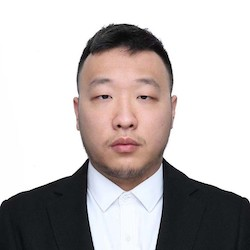

# About Wei Luo

Wei was born in Shanghai, China on November 17th, 2000. He moved to the US with family in 2017. He is currently a Computer Science undergraduate student at New York University. He will graduate in the Summer of 2024. He likes reading, traveling, coding, and 80s music when he has the time. 

As a computer science major, Wei is skilled in coding languages Java, HTML, C and Python. He is systematically learning Javascript. He speaks Mandarin and English and is learning Russian.

# Contact

Telephone Number: (646)-912-1038

School email: yl7408@nyu.edu

Personal email: yiweiluo205@gmail.com

Instagram account: yiluo250

# Portofolio

2007-2013: Shanghai Changning Yuyuan Road No.1 Elementary School

2013-2016: Shanghai Yan'an Junior High School

2017-2020: Holy Name Central Catholic High School

2020-: New York University

